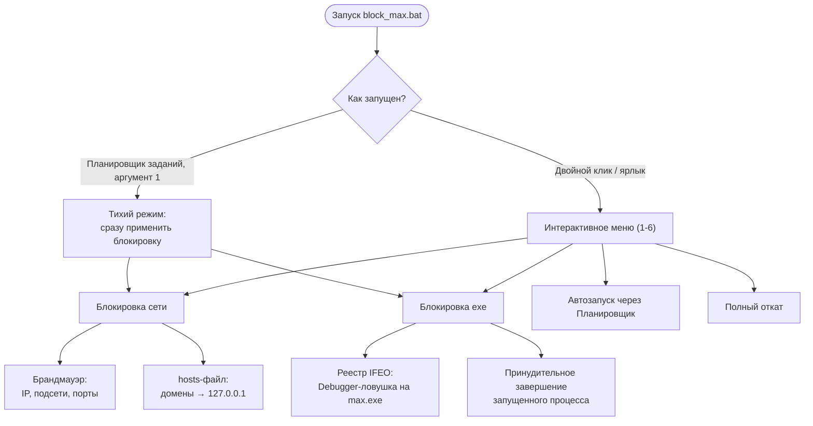

<div align="center">

**Комплексная локальная блокировка мессенджера MAX на Windows**
через брандмауэр, `hosts`, реестр и Планировщик заданий.


-89e051)


</div>

---

## Содержание

- [Возможности](#возможности)
- [Как это работает](#как-это-работает)
- [Требования](#требования)
- [Установка и запуск](#установка-и-запуск)
- [Меню скрипта](#меню-скрипта)
- [Что именно блокируется](#что-именно-блокируется)
  - [IP-адреса и подсети (брандмауэр)](#ip-адреса-и-подсети-брандмауэр)
  - [Порты (брандмауэр)](#порты-брандмауэр)
  - [Домены (hosts)](#домены-hosts)
  - [Процессы и реестр](#процессы-и-реестр)
- [Автозапуск](#автозапуск)
- [Полный откат](#полный-откат)
- [Известные ограничения](#известные-ограничения)
- [FAQ](#faq)
- [Вклад в проект](#вклад-в-проект)
- [Лицензия](#лицензия)
- [Отказ от ответственности](#отказ-от-ответственности)

---

## Возможности

| | |
|---|---|
| 🧭 **Интерактивное меню** | Управление всеми функциями из одного консольного меню |
| 🌐 **Блокировка сети** | Брандмауэр (IP-адреса, подсети, WebRTC-порты) + DNS-изоляция доменов через `hosts` |
| 🔒 **Запрет запуска EXE** | Ограничение на уровне реестра (Image File Execution Options) — приложение не откроется, даже после обновления |
| ⏱ **Автозапуск** | Скрытая задача в Планировщике Windows, которая тихо переприменяет блокировку при каждом входе в систему |
| ♻️ **Полный откат** | Удаление всех правил, веток реестра и задач автозапуска одним пунктом меню |
| 🪶 **Без зависимостей** | Только встроенные средства Windows: `netsh`, `hosts`, `reg`, `schtasks` |

## Как это работает



Скрипт не «взламывает» и не изменяет само приложение MAX — он работает на уровне операционной системы, перекрывая ему пути наружу (сеть) и запрет на запуск (реестр). Это тот же принцип, на котором строятся родительский контроль и корпоративные политики блокировки приложений.

## Требования

- Windows 10 или 11 (используются `netsh advfirewall`, `schtasks`, `reg` — стандартные компоненты системы).
- Права администратора. Скрипт запросит повышение прав через UAC самостоятельно, если его запустить без них.

## Установка и запуск

1. Скачайте `block_max.bat` (и, при желании, весь репозиторий целиком).
2. Кликните по файлу правой кнопкой мыши → **«Запуск от имени администратора»**.
   При обычном запуске скрипт сам предложит повышение прав через UAC.
3. В открывшемся меню введите номер нужного действия и нажмите **Enter**.


## Меню скрипта

| № | Действие |
|---|---|
| **1** | Перекрыть мессенджеру доступ в интернет и заблокировать его сайт |
| **2** | Полностью запретить запуск `max.exe` на компьютере |
| **3** | Добавить блокировку в автозапуск Windows (будет применяться при каждом входе в систему) |
| **4** | Убрать скрипт из автозапуска |
| **5** | Снять все ограничения и вернуть систему в исходное состояние |
| **6** | Выйти из утилиты |

## Что именно блокируется

### IP-адреса и подсети (брандмауэр)

Исходящий трафик блокируется правилами `netsh advfirewall`.

**Точечные IP-адреса** (`MAX_Core_IP_Block`):

| IP-адрес |
|---|
| `217.20.155.18` |
| `155.212.204.140` |
| `155.212.204.5` |
| `155.212.204.74` |

**Подсети инфраструктуры MAX / VK** (`MAX_VK_Subnets_Block`):

| Подсеть (CIDR) | Комментарий |
|---|---|
| `95.163.0.0/16` | Инфраструктура Mail.ru Group / VK |
| `217.20.144.0/20` | Сервисы экосистемы VK / Облако |
| `217.20.155.0/24` | Техническая подсеть инфраструктуры VK |
| `155.212.204.0/24` | Основные серверы MAX |
| `87.240.128.0/19` | Инфраструктура VK |
| `185.16.150.0/22` | Социальная сеть «Одноклассники» (Звонки) |
| `185.30.168.0/22` | Хостинг / Провайдер инфраструктуры Global Network Point |
| `128.140.168.0/21` | Инфраструктура VK (Почта, Облако, Портал) |
| `178.22.88.0/21` | Серверные мощности ИТ-инфраструктуры VK |

### Порты (брандмауэр)

Правило `MAX_Ports_Block` блокирует исходящий **UDP**-трафик на порты:

| Порт(ы) | Назначение |
|---|---|
| `3478` | STUN (используется для установления голосовых/видеозвонков) |
| `19302` | Google STUN-сервер |
| `50000–65535` | Широкий диапазон медиа/динамических портов (звонки, передача данных) |

> ⚠️ Диапазон `50000–65535` очень широкий и перекрывает почти весь диапазон динамических (эфемерных) портов Windows — подробнее см. [«Известные ограничения»](#известные-ограничения).

### Домены (hosts)

Скрипт дописывает блок `# MAX_BLOCK_START … # MAX_BLOCK_END` в `%WINDIR%\System32\drivers\etc\hosts`, перенаправляя домены на `127.0.0.1`. При повторном запуске старый блок сначала вырезается, затем записывается заново — так в hosts всегда актуальный список.

<details>
<summary><b>Показать полный список из 32 доменов</b></summary>

**Основные домены MAX:**
```
max.ru
web.max.ru
st.max.ru
dev.max.ru
download.max.ru
platform-api.max.ru
platform-api2.max.ru
```

**API-инфраструктура (`oneme.ru`, на который перешёл бэкенд MAX):**
```
oneme.ru
api.oneme.ru
api2.oneme.ru
i.oneme.ru
ws-api.oneme.ru
```

**Инфраструктура VK / OK (звонки и медиа):**
```
my.com
okcdn.ru
calls.okcdn.ru
iv.okcdn.ru
im.vk.me
static.vk.me
vk.com
www.vk.com
```

**Телеметрия и трекинг-SDK:**
```
apptracer.ru
sdk-api.apptracer.ru
trace-flow.ru
```

**Сервисы определения внешнего IP** (по данным независимых разборов трафика, MAX опрашивает их в обход собственных STUN-серверов — предположительно, чтобы проверить, не используется ли VPN):
```
api.ipify.org
api64.ipify.org
ifconfig.me
icanhazip.com
ipinfo.io
whoer.net
checkip.amazonaws.com
ip.mail.ru
ipv4-internet.yandex.net
ipv6-internet.yandex.net
```

</details>

> ⚠️ Часть этих сервисов (`ipify.org`, `ifconfig.me`, `icanhazip.com` и т.д.) — это общие, ничем не привязанные к MAX публичные сервисы, которыми пользуются и другие программы (VPN-клиенты, скрипты, сетевые утилиты). Блокируя их в `hosts`, вы блокируете их **для всей системы**, а не только для MAX.

### Процессы и реестр

- **`taskkill`** принудительно завершает уже запущенные `max.exe` и `max_updater.exe`.
- **`Image File Execution Options`** для `max.exe` и `max_updater.exe` — классический системный приём: при попытке запуска Windows пытается передать процесс несуществующему отладчику (`ntsd -d`), и приложение сразу же завершается, так и не открывшись. Работает даже после переустановки/обновления MAX, пока значение не удалено.
- Удаляются задачи автообновления мессенджера (`MAXUpdater`, `MAX AutoUpdate`) из Планировщика.

## Автозапуск

Пункт **3** меню создаёт в Планировщике задачу `MaxBlockerAutoRun`, которая при каждом входе в систему тихо (без открытия окна консоли) переприменяет блокировку сети и запуска exe. Реализовано через скрытый VBS-лаунчер (`max_block_silent.vbs`), создаваемый рядом со скриптом:

```vbs
Set WshShell = CreateObject("WScript.Shell")
WshShell.Run "cmd /c ""block_max.bat"" 1", 0, False
```

Аргумент `1` переводит скрипт в тихий режим: блокировка применяется сразу, без показа меню.

Пункт **4** убирает задачу из планировщика и удаляет лаунчер.

## Полный откат

Пункт **5** отменяет все изменения разом:

- удаляет правила брандмауэра (`MAX_Core_IP_Block`, `MAX_VK_Subnets_Block`, `MAX_Ports_Block`);
- удаляет ветки реестра `Image File Execution Options` для `max.exe` и `max_updater.exe`;
- вырезает блок `# MAX_BLOCK_START … # MAX_BLOCK_END` из `hosts`, не трогая остальные строки файла;
- сбрасывает DNS-кэш (`ipconfig /flushdns`).

Система возвращается в состояние, как будто скрипт никогда не запускался. Автозапуск (пункт 3) при этом отдельно нужно убрать пунктом **4**, если он был включён.

## Известные ограничения

Прежде чем запускать скрипт «на автомате», стоит учитывать несколько вещей:

- **Слишком широкий диапазон UDP-портов.** Правило блокирует исходящий UDP на порты `50000–65535` — это почти весь диапазон динамических портов Windows. Оно может задеть *другие* программы, которые используют высокие UDP-порты (игры, голосовые чаты, торренты, некоторые VPN). Если после блокировки что-то из этого перестало работать — вероятно, дело в этом правиле.
- **IP-check сервисы блокируются глобально.** `ipify.org`, `ifconfig.me`, `icanhazip.com` и подобные — общие публичные сервисы. Если вы сами используете их (например, в других скриптах или для проверки VPN), они тоже перестанут отвечать, пока активна блокировка.
- **Только IPv4.** Правила брандмауэра и `hosts` не покрывают IPv6 — если сервис станет доступен по IPv6-адресу, который не входит в список, блокировка может быть обойдена.
- **Инфраструктура меняется.** IP-адреса и домены сервиса могут со временем меняться. Список актуален на момент публикации; если блокировка перестала работать полностью — вероятно, появились новые адреса (Issues и PR приветствуются).
- **Возможные срабатывания антивируса.** Приём с `Image File Execution Options` (перехват запуска через фиктивный отладчик) используется и легитимными блокировщиками, и вредоносным ПО — некоторые антивирусы могут пометить это как подозрительную активность. Это ложное срабатывание: весь код скрипта открыт, его можно проверить целиком перед запуском.
- **Действует локально.** Скрипт ничего не отправляет по сети и не взаимодействует с чужими компьютерами — все изменения ограничены тем ПК, на котором он запущен.

## FAQ

**Как временно отключить блокировку, не удаляя всё насовсем?**
Пункт **5** меню полностью снимает все ограничения. Если нужно включить блокировку обратно — запустите пункты 1 и 2 заново.

**Блокировка перестала работать после обновления MAX.**
Скорее всего, у сервиса появились новые IP-адреса или домены. Откройте Issue с деталями (например, вывод `nslookup web.max.ru` или `tracert`) — список можно обновить.

**Ругается антивирус / SmartScreen.**
См. пункт про `Image File Execution Options` в разделе [«Известные ограничения»](#известные-ограничения). Скрипт полностью открыт — не запускайте бинарники «на слово», проверяйте исходный код `.bat`-файла перед использованием.

**Работает ли на Windows 7 / Server?**
Разрабатывалось и тестировалось на Windows 10/11. `netsh advfirewall` и `schtasks` есть и в более старых версиях, но поведение не гарантируется — используйте на свой риск.

## Вклад в проект

PR и Issues приветствуются — особенно:

- новые/изменившиеся IP-адреса и домены MAX;
- сужение диапазона блокируемых UDP-портов до более точного списка;
- отчёты о ложных срабатываниях антивирусов;
- тесты на других версиях Windows.

Если проект оказался полезен — поставьте ⭐ репозиторию, это помогает другим его найти. Буду благодарен за любую поддержку! Сказать «спасибо» автору можно здесь: **[DonationAlerts](https://www.donationalerts.com/r/zazzetka)**

## Лицензия

Проект распространяется по лицензии **GNU General Public License v2.0**. Полный текст — в файле [`LICENSE`](LICENSE).

## Отказ от ответственности

> [!IMPORTANT]
> Данный скрипт предоставлен исключительно в ознакомительных и административных целях. Перед ограничением работы программного обеспечения на целевом компьютере убедитесь, что у вас есть все необходимые полномочия и разрешения. Автор не несёт ответственности за возможные последствия использования скрипта.
